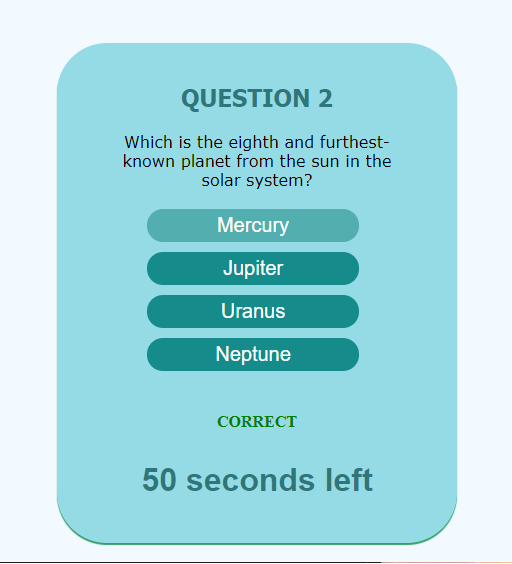

# 04 Web APIs: Code Quiz

In this task I have been asked to develop a quiz game with a timer and highscores that are saved. I enjoyed this task and happy am with how I solved the task independently. 

I started with the Question and Answer arrays. Each of these arrays have the questions and answers in the same order so that i could use an index to cycle through them in the same order. I then started simple and made these questions appear in each of the list elements at the current index. Getting the answers to appear randomly in the list elements was a real challenge and is where I decided to start creating the timer. 

Creating the timer was easy and I could refer to previous activities as guidence. I would later add the conditions if (index >= questions.length) and (seconds <= 0) to clear interval and invoke the gameOver(function). This became a slight problem where the next question is shown just before the interval kicks over to invoke the gameOver(function), to rectify this I had the if (conditions) in the nextQuestion(function) however then the interval would not be cleared and the next game would be -2 seconds every time. This was a problem I could not solve in the time I've had for the homework (will try and solve later).

After having the elements appear and creating the timer, I had to figure out how to have the action of clicking on an answer generate the next question, as well as knowing if the answer was correct or not. For this I used the event.target attribute to give the target of the "click" event listener. This is where I can use an if(statement) to check if the element (clickevent.target) is equal to the correctAnswers index, and then produce the next question. Then another else if to take seconds -- off the timer. The next function was then just a simple index++ (for the next index of the question/answer arrays), Question number++, and then the printText(function again).

The problem of generating each array on a random list element took me the longest to solve. Eventually I found a solution where I create a for loop that lets the index = the ulist length, then append the children in a random order with Math.random which runs for the length of the list items (4).

I did the start and gameOver(functions) at around the same time towards the end where i simply hid objects in CSS and then changed their display.style = "either none, block or flex". I Then created multiple event listeners for the Enter.key as well as a "Submit" button to submit scores. This then created a new problem (one which I will hopefully solve) where on the second run through, the score is printed multiple times at once, rather than just once. 

Overall I am quite happy with my finished product in a fairly short amount of time. I feel it could probably look a little nicer but I'm quite happy with most of the functionality. I also feel I could probably have some improvements with all the hidden and displayed elements and maybe tried to lump them all together a little more to reduce the amount of repeated code in the javascript.

Here is a Link to the deployed application: https://robert-rousset.github.io/Robs-Quiz-Game/

And the Screenshot:

